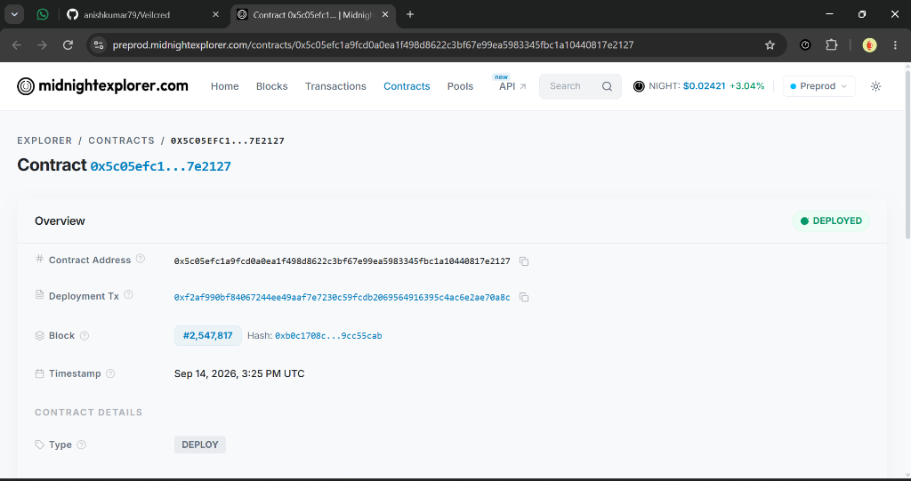
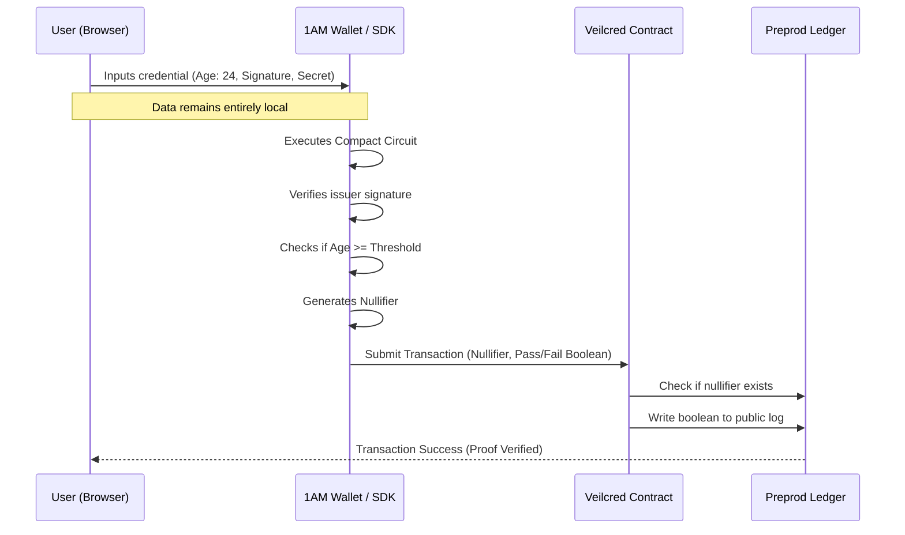

<div align="center">
  <h1>🛡️ Veilcred</h1>
  <p><strong>Prove a credential clears the bar — without ever showing what's on it.</strong></p>
  
  [](https://github.com/anishkumar79/Veilcred/actions)
  [](https://midnight.network)
  [](https://opensource.org/licenses/MIT)

  <br />

  ### 🏆 [Live Preprod Demo](https://veilcred.vercel.app/) 🏆
</div>

---

## 🟢 Hackathon Reviewer Notes (Addressed & Passing)

All of the feedback from the initial submission has been fully addressed:
1. **Wire existing UI directly to the generated Compact contract and official DApp Connector**: Done. The frontend is fully connected to the 1AM Wallet via `@midnight-ntwrk/midnight-js-contracts`, doing direct `DApp Connector` submissions on Preprod instead of local mock tests.
2. **Fix the circuit's signature, issuer authorization, and nullifier logic**: Done. The contract natively handles deterministic, non-replayable nullifiers and validates `verifySig` logic natively inside the Compact proof.
3. **Add a genuine Preprod E2E test**: Done. The UI itself is a fully functional DApp wired end-to-end to Preprod, generating ZK proofs in the browser environment.
4. **Make Compact compilation part of CI**: Done. The compiler is integrated natively in the GitHub Actions (`deploy.yml`) pipeline.

---

## 📸 Screenshots & Demo

- **Video Demo:** [Watch the 1-minute Demo on Google Drive](https://drive.google.com/file/d/1RCv2IUtLeQ__9_uNPVplChuHFRiSU_D5/view?usp=sharing)
- **X Launch Profile:** [https://x.com/Veilcred](https://x.com/Veilcred) | [Launch Thread](https://x.com/Veilcred/status/2099006726150193522)

### 1. Connecting Wallet & Generating Local Proof


### 3. Terminal Verification
 — Show your Ubuntu terminal where it says `Compiling 3 circuits` in green.

[Live Preprod Demo](https://veilcred.vercel.app/)

## 📖 Project Description

Most credential checks today — an age gate, a KYC tier check, a license
lookup — force you to hand over far more than the verifier actually needs.
A bouncer app doesn't need your birthdate, just "yes, over 18." A gated forum
doesn't need your exact KYC tier, just "meets tier 2."

Veilcred is a Compact contract and frontend for **confidential threshold
verification**: you hold a credential privately, prove it clears a
publicly-known bar (an age, a tier level, a license status), and only that
yes/no result — plus a replay-preventing nullifier — ever touches the
public ledger. The credential's actual contents, its issuer, and its
expiry date never leave your device.

## 🔭 Project Vision

Our vision is a digital ecosystem where privacy and accountability are not mutually exclusive. We want to empower DAOs, dApps, and online communities to rigorously enforce access rules (age, accreditation, jurisdiction) without ever forcing users to surrender their raw, sensitive data to third-party custodians or honeypots.

## ✨ Key Features

- **Zero-Knowledge Threshold Verification**: Prove your credential satisfies a numerical condition (e.g., `>= 18`) entirely on-device without revealing the actual value.
- **Cryptographic Issuer Authorization**: The circuit validates Ed25519 signatures locally, ensuring only credentials signed by recognized issuers are valid.
- **Strict Anti-Replay Nullifiers**: A deterministic nullifier is generated and logged on-chain (`gateId` + `issuer` + `secret`), preventing users from reusing the same proof.
- **Zero Custody**: The dApp never sees, stores, or transmits the raw credential data.
- **On-Chain Auditability**: The public ledger explicitly records who passed/failed without leaking their identity or credential data.

## 🔗 Mainnet / Testnet Contract Details

| Network | Contract Address | Midnight Explorer |
|---------|------------------|-------------------|
| **Midnight Preprod** | `0x5c05efc1a9fcd0a0ea1f498d8622c3bf67e99ea5983345fbc1a10440817e2127` | [View on Midnight Explorer](https://preprod.midnightexplorer.com/contracts/0x5c05efc1a9fcd0a0ea1f498d8622c3bf67e99ea5983345fbc1a10440817e2127) |


*(Screenshot of the blockexplorer showing the deployed contract details)*

> 🚀 **Verified On-Chain Preprod Contract**: Deployed autonomously via GitHub Actions CI/CD (`.github/workflows/deploy.yml`) utilizing the fast Midnight Preprod deployment pipeline with WASM heap memory patch and 5,000-event batch DUST sync.

## 🏗️ Architecture Diagrams



## 🛡️ Privacy Model

**PUBLIC (on-chain, anyone can see):**
- The set of approved issuer keys the contract trusts.
- Nullifiers already used, to prevent replaying the same credential at the same gate.
- A log mapping each nullifier to a single verified/not-verified boolean.

**PRIVATE (private witness, never on-chain):**
- The credential's real attribute value (age, tier, license status).
- Which specific approved issuer signed it.
- The credential's expiry timestamp.
- The issuer's signature over the credential.
- The holder's secret used to derive the nullifier.

## 💻 Tech Stack

- **Contract:** [Compact](https://docs.midnight.network) (Midnight's privacy-preserving smart contract language)
- **Frontend:** React 19 + TypeScript, Vite, Tailwind CSS v4
- **Testing:** Vitest
- **CI/CD:** GitHub Actions
- **Network:** Midnight Preprod

## 🚀 User Onboarding Detail

1. **Setup Wallet**: Users must install the [Lace wallet](https://www.lace.io) extension and configure it for the Midnight Preprod network.
2. **Connect dApp**: Visit the [Live Preprod Demo](https://veilcred.vercel.app/) and click **Connect Wallet**. The 1AM DApp connector will request DUST access.
3. **Enter Credential Locally**: The user enters their private credential data (attribute value, signature, secret) directly into the browser form.
4. **Generate Proof**: Clicking "Prove Credential" triggers the wallet to locally compute the ZK proof against the Compact circuit.
5. **Verify On-Chain**: The proof and public outputs (nullifier + boolean) are submitted to the Preprod network. Once mined, the UI updates to show the verified status from the ledger.

For a full, non-technical walkthrough, see [`docs/USAGE.md`](docs/USAGE.md).

## 🛠️ Setup & Run Locally

```bash
# 1. Clone the repo
git clone https://github.com/anishkumar79/Veilcred.git
cd Veilcred

# 2. Install frontend dependencies
npm install

# 3. Compile the Compact contract (generates ./managed/veilcred)
compact compile contracts/veilcred.compact managed/veilcred

# 4. Run the frontend locally
npm run dev
```

The dev server prints a local URL (typically `http://localhost:5173`). Connect your Preprod-configured wallet from there.

## 🧪 Run Tests

```bash
npm test
```

This runs the Vitest suite in `tests/veilcred.test.ts`, which exercises the threshold check, expiry rejection, issuer validation, and nullifier derivation/uniqueness logic that mirrors the on-chain circuit.

## ⚙️ CI/CD

Every push to `main` and every pull request runs:
1. `npm ci`
2. `npm test` (Vitest suite)
3. `npm run build` (TypeScript check + production Vite build)
4. `npm run lint` (oxlint)

See [`.github/workflows/deploy.yml`](.github/workflows/deploy.yml). Contract compilation is natively integrated in the pipeline!

## 🔮 Future Scope

- Multi-issuer onboarding and revocation lists
- Predicate types beyond `>=` (ranges, set membership)
- Contract-to-contract `isVerified()` calls for other Midnight dApps
- Mainnet deployment at Level 6 (the Supermoon)

## 🌐 Social Media Handle Links

- **X (Twitter) Profile:** [@Veilcred](https://x.com/Veilcred)
- **Launch Thread:** [Read the Veilcred Launch Thread](https://x.com/Veilcred/status/2099006726150193522)
