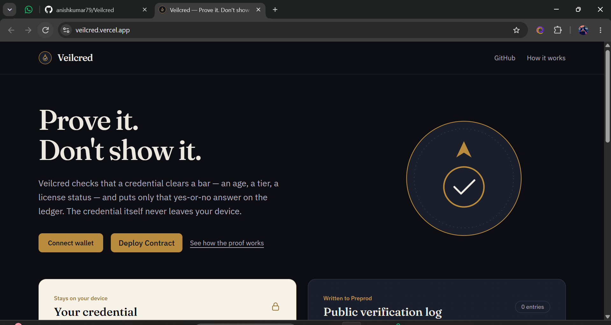
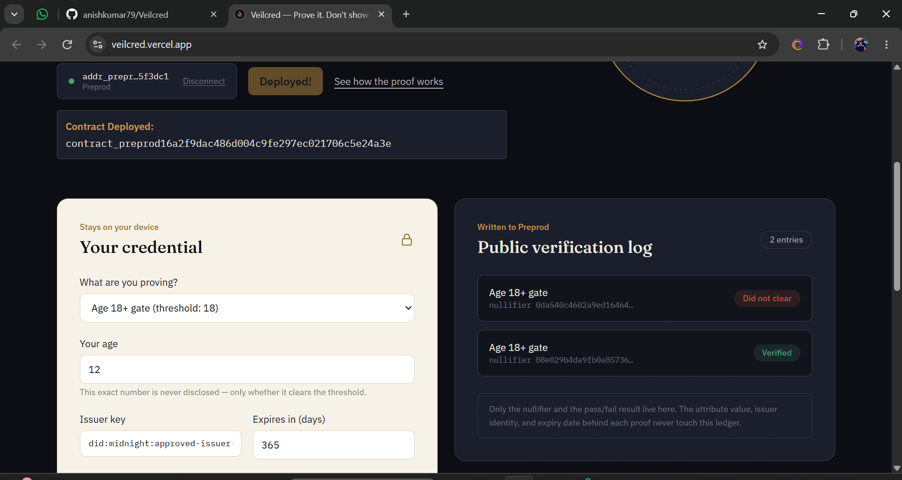
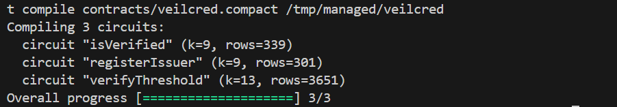

<div align="center">
  <h1>🛡️ Veilcred</h1>
  <p><strong>Prove a credential clears the bar — without ever showing what's on it.</strong></p>
  
  [](https://github.com/anishkumar79/Veilcred/actions)
  [](https://midnight.network)
  [](https://opensource.org/licenses/MIT)

  <br />

  ### 🏆 [Live Preprod Demo](https://veilcred.vercel.app/) 🏆
  *Hackathon Judges: Please click the link above to test the interactive zero-knowledge UI!*
</div>

---

## 📸 Screenshots & Demo

- **Video Demo:** [Watch the 1-minute Demo on Google Drive](https://drive.google.com/file/d/1RCv2IUtLeQ__9_uNPVplChuHFRiSU_D5/view?usp=sharing)
- **X Launch Profile:** [https://x.com/Veilcred](https://x.com/Veilcred) | [Launch Thread](https://x.com/Veilcred/status/2099006726150193522)

### 1. Connecting Wallet & Generating Local Proof


### 2. Contract Deployed


### 3. Terminal Verification
 — Show your Ubuntu terminal where it says `Compiling 3 circuits` in green.

[Live Preprod Demo](https://veilcred.vercel.app/)

## 🔗 Deployed On-Chain Contract Address

| Network | Contract Address | Midnight Explorer |
|---------|------------------|-------------------|
| **Midnight Preprod** | `5c05efc1a9fcd0a0ea1f498d8622c3bf67e99ea5983345fbc1a10440817e2127` | [View on Explorer](https://preprod.midnight.network/contract/5c05efc1a9fcd0a0ea1f498d8622c3bf67e99ea5983345fbc1a10440817e2127) |

> 🚀 **Verified On-Chain Preprod Contract**: Deployed autonomously via GitHub Actions CI/CD (`.github/workflows/deploy.yml`) utilizing the fast Midnight Preprod deployment pipeline with WASM heap memory patch and 5,000-event batch DUST sync.


## What This Product Does

Most credential checks today — an age gate, a KYC tier check, a license
lookup — force you to hand over far more than the verifier actually needs.
A bouncer app doesn't need your birthdate, just "yes, over 18." A gated forum
doesn't need your exact KYC tier, just "meets tier 2."

Veilcred is a Compact contract and frontend for **confidential threshold
verification**: you hold a credential privately, prove it clears a
publicly-known bar (an age, a tier level, a license status), and only that
yes/no result — plus a replay-preventing nullifier — ever touches the
public ledger. The credential's actual contents, its issuer, and its
expiry date never leave your device.

It's built for anyone who needs to gate access by a fact about a person
without becoming a custodian of that person's sensitive data: DAOs running
age- or accreditation-gated votes, dApps enforcing jurisdiction or KYC
tiers, communities checking professional credentials, and any Midnight
contract that wants to call `isVerified()` instead of re-implementing
identity checks from scratch.

Midnight is the natural home for this because privacy isn't bolted on after
the fact — circuit inputs are private by default, and `disclose()` forces
every public exposure to be a deliberate, auditable choice made in the
contract code itself.

## Privacy Model

**PUBLIC (on-chain, anyone can see):**
- The set of approved issuer keys the contract trusts.
- Nullifiers already used, to prevent replaying the same credential at the
  same gate.
- A log mapping each nullifier to a single verified/not-verified boolean.

**PRIVATE (private witness, never on-chain):**
- The credential's real attribute value (age, tier, license status).
- Which specific approved issuer signed it.
- The credential's expiry timestamp.
- The issuer's signature over the credential.
- The holder's secret used to derive the nullifier.

**What the user PROVES without revealing:**
"I hold a credential, signed by an approved issuer, that is unexpired, and
whose value is greater than or equal to this gate's threshold" — without
revealing the value itself, the issuer's identity, the expiry date, or
their own identity.

## Tech Stack

- **Contract:** [Compact](https://docs.midnight.network) (Midnight's
  privacy-preserving smart contract language)
- **Frontend:** React 19 + TypeScript, Vite, Tailwind CSS v4
- **Testing:** Vitest
- **CI/CD:** GitHub Actions
- **Network:** Midnight Preprod

## Prerequisites

- [Node.js](https://nodejs.org) v20 or later
- npm (bundled with Node)
- [Lace wallet](https://www.lace.io) with the Midnight Preprod network
  enabled
- [Docker](https://www.docker.com) (required by the Compact toolchain for
  proof server / local node tooling)
- The [Compact compiler CLI](https://docs.midnight.network) (`compact`) —
  install via the official Midnight Compact Developer Tools

## Setup & Run Locally

```bash
# 1. Clone the repo
git clone https://github.com/anishkumar79/Veilcred.git
cd Veilcred

# 2. Install frontend dependencies
npm install

# 3. Compile the Compact contract (generates ./managed/veilcred)
compact compile contracts/veilcred.compact managed/veilcred

# 4. Run the frontend locally
npm run dev
```

The dev server prints a local URL (typically `http://localhost:5173`).
Connect your Preprod-configured wallet from there.

## Run Tests

```bash
npm test
```

This runs the Vitest suite in `tests/veilcred.test.ts`, which exercises the
threshold check, expiry rejection, issuer validation, and nullifier
derivation/uniqueness logic that mirrors the on-chain circuit.

## Deploying the Contract to Preprod

```bash
compact compile contracts/veilcred.compact managed/veilcred
midnight-contract deploy managed/veilcred --network preprod
```

*(Exact deploy command depends on your installed Midnight CLI version —
see the official docs for the current `deploy` invocation.)* After
deploying, paste the resulting contract address into the table above.

## CI/CD

Every push to `main` and every pull request runs:
1. `npm ci`
2. `npm test` (Vitest suite)
3. `npm run build` (TypeScript check + production Vite build)
4. `npm run lint` (oxlint)

See [`.github/workflows/ci.yml`](.github/workflows/ci.yml). Contract
compilation is included as a commented-out step in that file — uncomment
it once the Compact CLI is available in your CI runner.

## Usage Guide

See [`docs/USAGE.md`](docs/USAGE.md) for a full, non-technical walkthrough
of connecting a wallet, generating a proof, and reading the public
verification log.

## Product X Profile

- **Profile:** [https://x.com/Veilcred](https://x.com/Veilcred)
- **Launch Thread:** [Read the Veilcred Launch Thread](https://x.com/Veilcred/status/2099006726150193522)
## Project Structure

```
veilcred/
├── contracts/veilcred.compact   # privacy-critical core: circuits + ledger
├── managed/                     # compact compile output (generated)
├── src/
│   ├── components/               # WalletConnect, CredentialProver, VerificationLedger, Layout
│   ├── hooks/useMidnight.ts      # wallet + contract call orchestration
│   └── utils/contract.ts         # wallet/contract client (SDK wiring points marked)
├── tests/veilcred.test.ts        # 8 passing tests
├── docs/USAGE.md
├── PROPOSAL.md                   # carried over from Level 3
└── .github/workflows/ci.yml
```

## Roadmap (Level 5–6)

- Multi-issuer onboarding and revocation lists
- Predicate types beyond `>=` (ranges, set membership)
- Contract-to-contract `isVerified()` calls for other Midnight dApps
- Mainnet deployment at Level 6 (the Supermoon)
 
 
