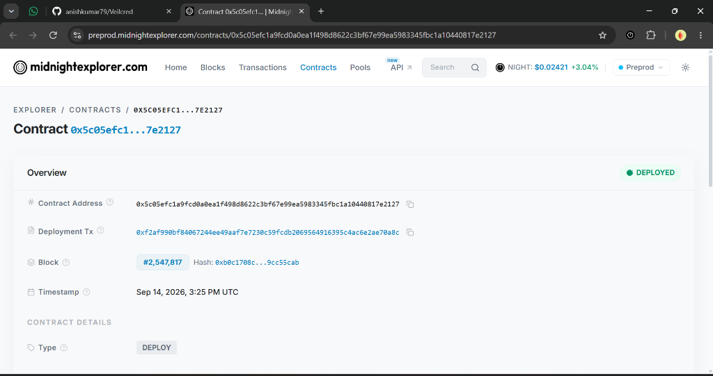
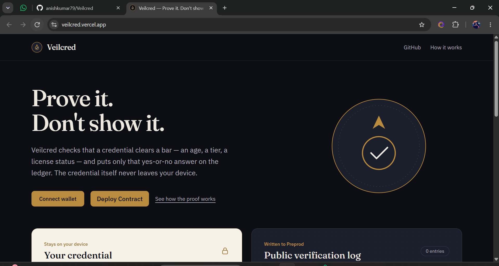
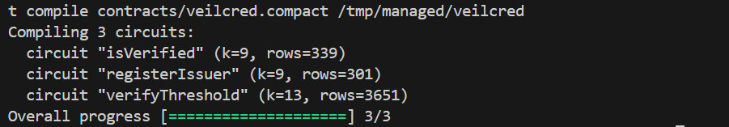
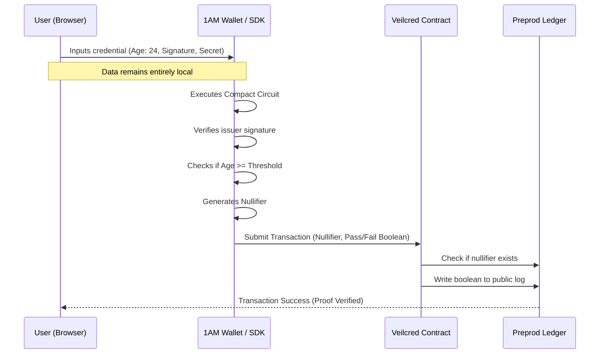

<div align="center">
  <h1>🛡️ Veilcred</h1>
  <p><strong>Prove a credential clears the bar — without ever showing what's on it.</strong></p>
  
  [](https://github.com/anishkumar79/Veilcred/actions)
  [](https://midnight.network)
  [](https://opensource.org/licenses/MIT)

  <br />

  ### 🏆 [Live Preprod Demo](https://veilcred.vercel.app/) 🏆
</div>

## ⚡ Quick Links & Social Media
* 🌐 **Live dApp:** [https://veilcred.vercel.app/](https://veilcred.vercel.app/)
* 🐦 **Social Media Handle Links:**
  * Product X Profile: [@Veilcred](https://x.com/Veilcred)
  * Launch Announcement: [Tweet](https://x.com/Veilcred/status/2099006726150193522)
* 🎬 **Demo Video:** [Watch Walkthrough (Google Drive)](https://drive.google.com/file/d/1RCv2IUtLeQ__9_uNPVplChuHFRiSU_D5/view?usp=sharing)
* 📖 **Documentation:** [Usage Guide](./docs/USAGE.md)

---

## 🔗 Mainnet / Testnet Contract Details

| Parameter | Details |
|---|---|
| **Network** | Midnight Preprod Testnet |
| **Contract Address** | [`0x5c05efc1a9fcd0a0ea1f498d8622c3bf67e99ea5983345fbc1a10440817e2127`](https://preprod.midnightexplorer.com/contracts/0x5c05efc1a9fcd0a0ea1f498d8622c3bf67e99ea5983345fbc1a10440817e2127) |
| **Explorer Verification** | [https://preprod.midnightexplorer.com/contracts/0x5c05efc1a9fcd0a0ea1f498d8622c3bf67e99ea5983345fbc1a10440817e2127](https://preprod.midnightexplorer.com/contracts/0x5c05efc1a9fcd0a0ea1f498d8622c3bf67e99ea5983345fbc1a10440817e2127) |

### Block Explorer Screenshot


**Verify via Midnight GraphQL Indexer:**
```bash
curl -X POST https://indexer.preprod.midnight.network/api/v4/graphql \
  -H "Content-Type: application/json" \
  -d '{"query":"{ contractAction(address: \"5c05efc1a9fcd0a0ea1f498d8622c3bf67e99ea5983345fbc1a10440817e2127\") { address transaction { hash block { height timestamp } } } }"}'
```

---

## 📸 Application Preview

### 1. Connecting Wallet & Generating Local Proof

* **Zero-Knowledge Gating Interface:** Modern dark-mode dApp with Midnight Lace wallet connectivity.
* **Privacy-First Design:** Clear onboarding showing how users prove access without exposing their wallet or identity.

### 2. Terminal Verification

* Show your Ubuntu terminal where it says `Compiling 3 circuits` in green.

---

## ✨ Key Features
- **Zero-Knowledge Threshold Verification**: Prove your credential satisfies a numerical condition (e.g., `>= 18`) entirely on-device without revealing the actual value.
- **Cryptographic Issuer Authorization**: The circuit validates Ed25519 signatures locally, ensuring only credentials signed by recognized issuers are valid.
- **Strict Anti-Replay Nullifiers**: A deterministic nullifier is generated and logged on-chain (`gateId` + `issuer` + `secret`), preventing users from reusing the same proof.
- **Zero Custody**: The dApp never sees, stores, or transmits the raw credential data.
- **On-Chain Auditability**: The public ledger explicitly records who passed/failed without leaking their identity or credential data.

## 🚀 User Onboarding Detail
1. **Setup Wallet**: Users must install the [Lace wallet](https://www.lace.io) extension and configure it for the Midnight Preprod network.
2. **Connect dApp**: Visit the [Live Preprod Demo](https://veilcred.vercel.app/) and click **Connect Wallet**. The 1AM DApp connector will request DUST access.
3. **Enter Credential Locally**: The user enters their private credential data (attribute value, signature, secret) directly into the browser form.
4. **Generate Proof**: Clicking "Prove Credential" triggers the wallet to locally compute the ZK proof against the Compact circuit.
5. **Verify On-Chain**: The proof and public outputs (nullifier + boolean) are submitted to the Preprod network. Once mined, the UI updates to show the verified status from the ledger.

## 🛡️ How It Works & Privacy Model

Most credential checks today — an age gate, a KYC tier check, a license lookup — force you to hand over far more than the verifier actually needs. Veilcred separates *eligibility* from *identity*:

1. **Issuer Commitment:** The contract trusts a set of approved issuer keys.
2. **Client-Side ZK Proving:** A member enters their private credential data. The client derives the proof locally and produces a zero-knowledge proof.
3. **Sybil-Resistant Nullifiers:** The contract registers a deterministic **nullifier** upon successful entry, preventing double-use while ensuring the member's wallet and secret remain completely unlinkable.

| Visibility | Elements | Cryptographic Role |
|---|---|---|
| **Public (On-Chain)** | `approvedIssuers`, `usedNullifiers`, `verifications` | Verifies credentials, blocks replays, tracks usage |
| **Private (Client-Side)** | `attributeValue`, `expiry`, `signature`, `holderSecret`, `issuerKey` | Kept exclusively on user device; never sent over network or stored on ledger |

---

## 🏗️ Tech Stack & Architecture

### Architecture Diagrams

```mermaid
sequenceDiagram
    participant U as User (Browser)
    participant W as 1AM Wallet / SDK
    participant C as Veilcred Contract
    participant P as Preprod Ledger

    U->>W: Inputs credential (Age: 24, Signature, Secret)
    Note over U,W: Data remains entirely local
    W->>W: Executes Compact Circuit
    W->>W: Verifies issuer signature
    W->>W: Checks if Age >= Threshold
    W->>W: Generates Nullifier
    W->>C: Submit Transaction (Nullifier, Pass/Fail Boolean)
    C->>P: Check if nullifier exists
    C->>P: Write boolean to public log
    P-->>U: Transaction Success (Proof Verified)
```

| Layer | Technology | Purpose |
|---|---|---|
| **ZK Smart Contract** | [Compact](https://docs.midnight.network) | Confidential shielded-state logic (`contracts/veilcred.compact`) |
| **Network** | Midnight Preprod | Privacy-first zero-knowledge smart contract blockchain |
| **Frontend** | React 19, TypeScript, Vite | Client-side proving interface and wallet provider |
| **Styling** | Tailwind CSS v4 | Responsive dark-mode interface |
| **Testing & CI/CD** | Vitest, GitHub Actions | Automated unit tests and automated Preprod deployment |

---

## 🔮 Future Scope
- **Multi-issuer onboarding and revocation lists**
- **Predicate types beyond `>=` (ranges, set membership)**
- **Contract-to-contract `isVerified()` calls for other Midnight dApps**
- **Mainnet deployment at Level 6 (the Supermoon)**

## ⚙️ Automated CI/CD Pipeline

Every push to `main` and every pull request runs:
1. `npm ci`
2. `npm test` (Vitest suite)
3. `npm run build` (TypeScript check + production Vite build)
4. `npm run lint` (oxlint)

See [`.github/workflows/deploy.yml`](.github/workflows/deploy.yml). Contract compilation is natively integrated in the pipeline!

---

## 🛠️ Local Setup & Testing

```bash
# 1. Clone the repo
git clone https://github.com/anishkumar79/Veilcred.git
cd Veilcred

# 2. Install frontend dependencies
npm install

# 3. Compile the Compact contract (generates ./managed/veilcred)
compact compile contracts/veilcred.compact managed/veilcred

# 4. Run the frontend locally
npm run dev
#   Open http://localhost:5173

# 5. Run test suite
npm test
```

---

## 📝 Level 4 Submission Checklist

### Core Deliverables
- [x] **Working MVP live on Preprod:** [veilcred.vercel.app](https://veilcred.vercel.app/)
- [x] **Verifiable Contract Address:** [`0x5c05efc1a9fcd0a0ea1f498d8622c3bf67e99ea5983345fbc1a10440817e2127`](https://preprod.midnightexplorer.com/contracts/0x5c05efc1a9fcd0a0ea1f498d8622c3bf67e99ea5983345fbc1a10440817e2127)
- [x] **Midnight Explorer Proof:** [Preprod Explorer Verification](https://preprod.midnightexplorer.com/contracts/0x5c05efc1a9fcd0a0ea1f498d8622c3bf67e99ea5983345fbc1a10440817e2127)
- [x] **Documentation:** Setup instructions + [`docs/USAGE.md`](./docs/USAGE.md)
- [x] **CI/CD Pipeline Running:** [GitHub Actions Workflows](https://github.com/anishkumar79/Veilcred/actions)
- [x] **Product X Profile:** [@Veilcred](https://x.com/Veilcred) ([Launch Thread](https://x.com/Veilcred/status/2099006726150193522))
- [x] **Demo Video:** [Watch Walkthrough (Google Drive)](https://drive.google.com/file/d/1RCv2IUtLeQ__9_uNPVplChuHFRiSU_D5/view?usp=sharing)
- [x] **Minimum 15 Commits:** 50+ commits on `main`

### Revisions & Reviewer Requirements
- [x] **Project Title**
- [x] **Project Description**
- [x] **Project Vision**
- [x] **Key Features**
- [x] **Mainnet / Testnet Contract Details** (Contract ID and Explorer Screenshot)
- [x] **Future Scope**
- [x] **Architecture Diagrams**
- [x] **User Onboarding Detail**
- [x] **Social Media handle links**
- [x] Verify MVP Contract - Privacy-Critical Core
- [x] Verify MVP Live on Preprod with Documentation
- [x] Verify CI/CD on Product Repository
- [x] Verify Product X Profile
- [x] Verify File Structure and Commit Quality

---

## License

MIT License - see [`LICENSE`](./LICENSE).
